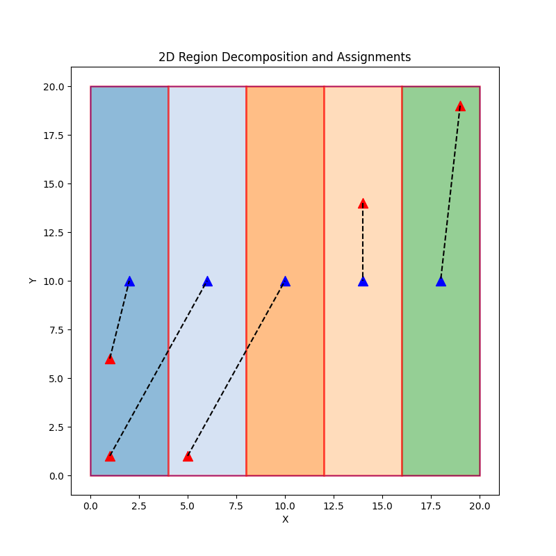
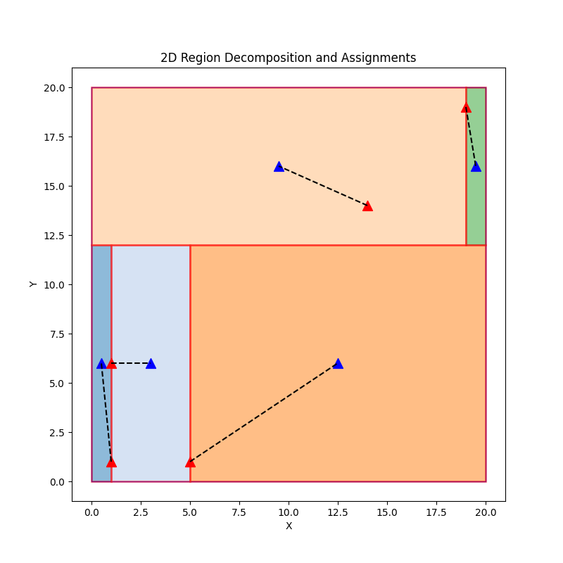
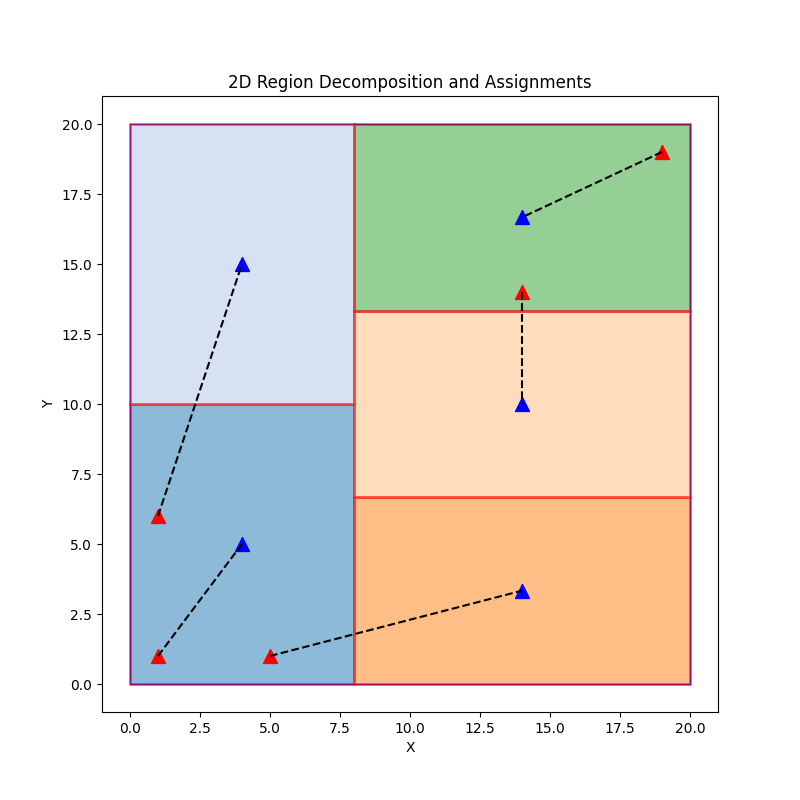
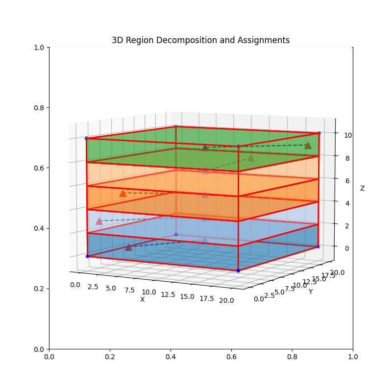
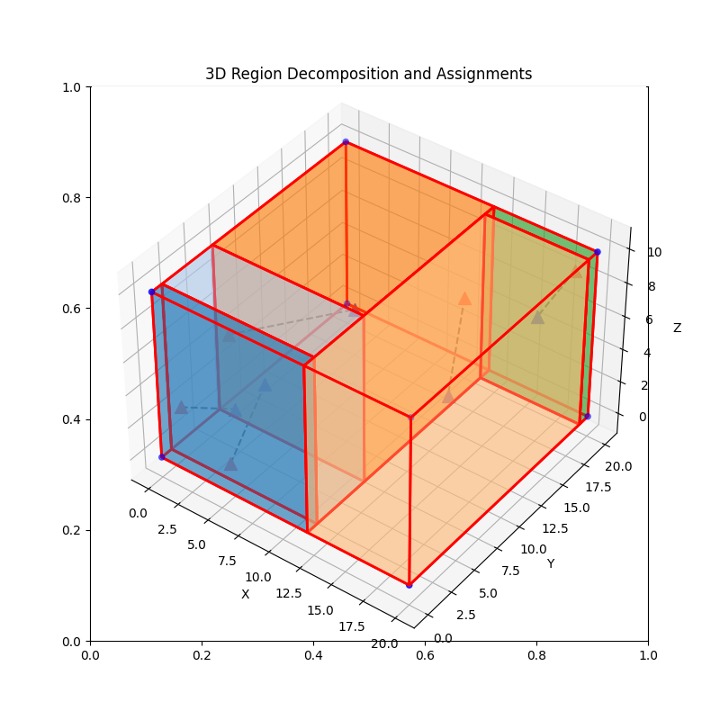
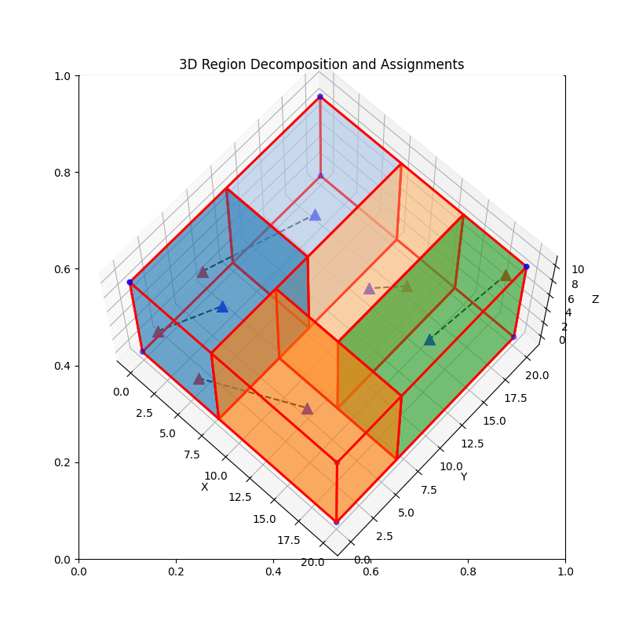

# Region Decomposition

The cuboid region is evenly divided into a specified number of cuboid subareas.

## Parameters

- cuboid_ll ```(x,y,z)```: Lower left corner coordinates of the cuboid
- cuboid_tr ```(x,y,z)```: Top right corner coordinate of cuboid
- n_a ```x```: Number of agents
- agent_positions ```[(x,y,z), ...]```: Initial positions of the agents

## Usage

```python
python main.py
```

## Result




---


